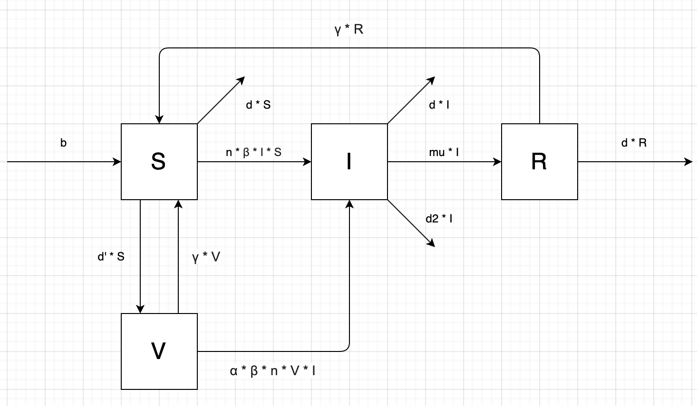

#  BSVIRD COVID-19 Pandemic Model 
This repository contains the codebase for a COVID-19 Pandemic Model made using Python and hosted on NanoHub. This model was a class project for ENGR-E 340/599, Introduction to Computational Bioengineering, offered by Indiana University during the Fall 2020 semester. 

### Description
This model is designed to show the impact that different vaccination implementations would have on an affected populace during a COVID-19 pandemic scenario. More information can be found on the NanoHub webpage [https://nanohub.org/tools/bsvirdcovid19mo](https://nanohub.org/tools/bsvirdcovid19mo).

